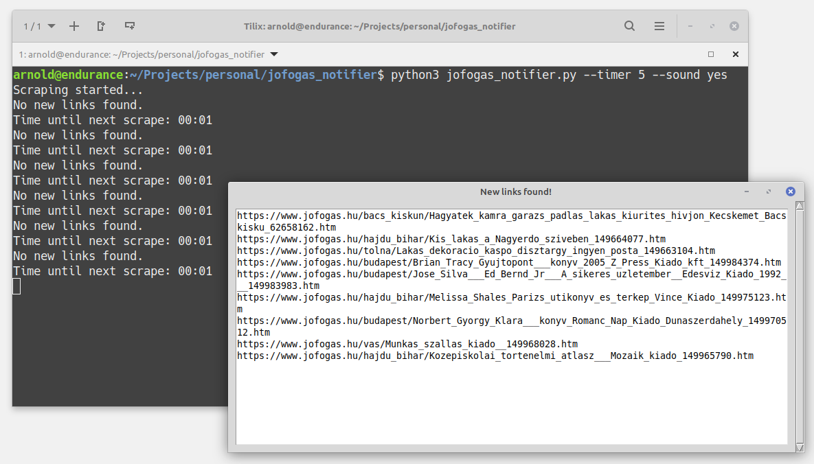

# Jofogas.hu Scraper & Ad Notifier



## Description

Scrapes the jofogas.hu website in specified intervals for new links based on search queries and notifies the user when new links are found. 

## Requirements

- Python 3
- beautifulsoup4
- playsound
- tkinter

## Installation

1. Clone the repository:
    ```sh
    git clone https://github.com/csisztaiarnold/jofogas_notifier.git
    cd jofogas_notifier
    ```
2. Install the required dependencies:
    ```sh
    pip install -r requirements.txt
    ```

## Usage

Modify the `search_queries.txt` list file to include your desired search queries. Separate each query with a new line.

Run the script with the following command:
```sh
python3 jofogas_notifier.py --timer <time_in_seconds> --sound <yes|no>
```

### timer

Sets the interval in seconds between each search query. Default value is `300` (5 minutes).

### sound

Enables or disables the notification sound. Default value is `no`.

